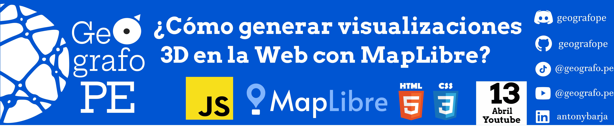

Este repositorio 🗂️ contiene una serie de pasos de como generar los insumos necesarios para realizar una visualización en 3D de cualquier parte del mundo usando MapLibre 
con el lenguaje de programación de `Js` junto con una estructura de `HTML` y algo de estilos con `CSS`. 

Para este video usaremos las siguientes herramientas:

- [rio-rgbify](https://github.com/mapbox/rio-rgbify): Módulo de Python que permite convertir datos raster en teselas codificadas en formato RGB.
- [mbutils](https://github.com/mapbox/mbutil): Herramienta basada en Python que permite convertir un MBTiles en teselas organizadas por carpetas o directorios según el niveles de zoom, filas y columnas, siguiendo el esquema Z/X/Y el cual es muy utilizado en la visualización web.
- [QGIS](https://www.qgis.org/): Software de Sistema de Información Geográfica libre y de código abierto que permite manipular, editar, analizar y visualizar datos espaciales.
  - Plugin: [JAXA Earth API Plugin](https://plugins.qgis.org/plugins/qgis-jaxa-earth-plugin-master/): API para QGIS que permite descargar datos de la Agencia Japonesa de Exploración Aeroespacial.
- [MapLibre GL JS](https://maplibre.org/maplibre-gl-js/docs/): Librería de TypeScript que utiliza WebGL para renderizar mapas interactivos a partir de mosaicos vectoriales en el navegador.

## 🔵 Pasos para generar Terrenos en 3D con MapLibre

1. Primer paso: Instalación del plugin para la descarga del DSM del área de interes
2. Segundo paso: Generar del DSM descargado un MBTiles.
3. Tercer paso: Generar directorios o carpetas según el nivel de zoom, filas y columnas provenientes del MBTiles.
4. Cuarto paso: Generar la visualización en 3D con Maplibre.

Todo el proceso desarrollado esta explicado paso a paso en el siguiente video de Youtube 🎥.

¡Enteráte más y aprender conmigo! 🔍💡 Suscríbete, activa las notificaciones 🔔 y únete a la comunidad que ama el software libre de código abierto. 🌟🌍 👇
-  https://www.youtube.com/@geografope

-  https://www.tiktok.com/@geografope

-  https://www.linkedin.com/in/antonybarja/

## 🔵 Referencias: 
 - *https://maplibre.org/maplibre-gl-js/docs/examples/3d-terrain/*
 - *https://plugins.qgis.org/plugins/qgis-jaxa-earth-plugin-master/*
 - *https://github.com/mapbox/mbutil*
 - *https://github.com/mapbox/rio-rgbify*